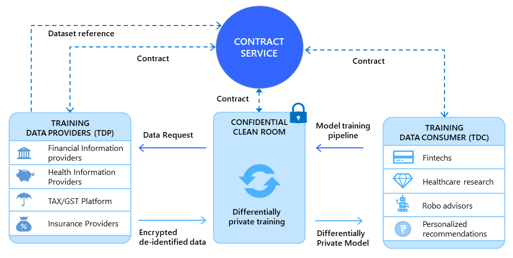

# Architecture

It is widely recognized that training accurate, fair, and unbiased AI models requires diverse datasets. However, sharing datasets across organizations in a secure and complaint manner is often a tedious and time-consuming process. Organizations need to build trust between each other, and develop legal and technical terms under which datasets will be shared. From a regulatory perspective, this process lacks transparency and creates market distortions, with only a handful of large organizations being able to accumulate sufficiently diverse datasets. 

The DEPA training framework (shown above) is a _techno-legal framework_ that democratizes and accelerates this process by providing a pre-certified secure, privacy preserving, and compliant process for Training Data Providers (TDP) to share datasets with any Training Data Consumers (TDC), obtain compensation in return, and share returns with data principals. 

In the DEPA training framework, TDPs and TDCs register with a central registry setup by the SRO. After SRO verifies their identities, TDPs and TDCs sign a common agreement, accepting the terms of participation in the framework.

Next, TDPs register their datasets with a [contract service](./contract_service_specifications.md) setup by the SRO along with the terms of availability. At the same time, TDPs encrypt their datasets with their own encryption keys hosted in their key management systems (KMS) and host endpoints where encrypted datasets can be accessed. 

At any time, TDCs can query the contract service for available datasets. TDCs can use sample datasets provided by the TDPs to develop their initial models. Once a TDC has identified the datasets they wish to use, the TDC enters into a digital contract with the TDPs. Contract may be two-party (between a TDC and a single TDP), or multi-party (between a TDC and multiple TDPs). Contracts specify the datasets being shared and terms under which sharing is permitted. Terms include security and privacy constraints in line with standards set by the SRO, the purpose for which datasets are being shared, period of the contract, and payment terms. 

After agreeing on a contract, TDPs and TDCs digitally sign the contract using their long term digital identities and register signed contract with the contract service. A contract is said to be valid only when all participants in the contract have signed.

Next, the TDC (or a CCR provider that acts on behalf of the TDC) sets up a [confidential clean room](./confidential_clean_room_design.md) (CCR) with a set of signed contracts and additional configuration describing the model that the TDC wishes to train (e.g., initial weights, hyperparameters etc). The CCR is a secure environment the provides hardware based security and privacy for datasets and models during use. The CCR is deployed with a privacy-preserving analytics and ML framework certified by the SRO.

The CCR obtains encryption keys for TDP datasets from the TDPs KMS. The TDP KMS release keys to the CCR after verifying CCR attestation reports. The CCR decrypts the dataset, and trains the model with privacy guarantees. After training is complete, the CCR notifies the contract service, which can trigger external payment services to trigger payments to the TDPs in real time as per the terms of the contract. 

This framework aims to meet the principles of zero trust and privacy-by-design. The CCR ensures that raw datasets are never revealed to the TDC or any entity such as the CCR provider or the cloud provider acting on behalf of the TDC. Also, the TDC's model architecture or weights are not revealed to the TDPs.

We recognize that no technology or framework is perfect. Some TDCs and TDPs may act with malicious intent. Vulnerabilities may be discovered in contract services and CCRs implementations. New privacy technologies might emerge that invalidate current best practices. Instances of the DEPA training framework will be designed for resiliency in the face of such changes.  
