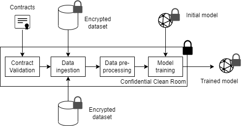

# Confidential Clean Rooms

A confidential clean room (CCR) is a secure environment in which training datasets from one or more TDPs can be processed to train models while preserving privacy of data principals. CCRs support typical stages of an ML workflow, including data ingestion, aggregation, pre-processing and training within the constraints specified in contracts. This document describes functional and security requirements for confidential clean rooms. 

## Dataset Format

TDPs shall publish datasets in schemas defined by the SRO. Dataset references registered with the contract service MUST contain a reference to an SRO specified schema. Contract services may check dataset references for well-formedness at registration. 

The SRO shall also define common formats for encrypted datasets. For example, datasets may be shared as binary files with AES-GCM encryption, or encrypted disk images protected using dm-crypt and dm-verity or dm-integrity/dm-verity. 

## CCR Creation

When the TDC wishes to train or fine-tune a model, the CCR provider shall create a new CCR. A CCR may consist of one or more hardware isolated VMs with attached devices such as confidential ML accelerators and network cards. Each CCR is configured with 
  - public identity of the contract service
  - URL of the contract service(s) which issued the contracts
  - set of contracts that will be used as a basis for training (specified as contract numbers, identifiers, or COSE signed objects)
  - storage locations of training datasets
  - storage location of the model to be trained
  - model configuration, which may include hyper-parameters 
  - any additional configuration required by the CCR to access datasets e.g., access tokens. 

CCRs are ephemeral compute resources created for each training task. In other words, CCRs SHALL not reused across multiple training tasks. 

## Attestation 

The hardware supporting CCRs MUST generate attestation reports that capture the full trusted computing base (TCB) of the CCR. This includes (but not limited to) code and configuration of contract validation, secure key release, data and model loading, encryption and decryption, pre-processing, and training.

To protect the TDC's IP, attestation reports will not capture TDC secrets such as the model architecture, weights, and non-privacy related hyper-parameters. 

To ensure stable key release policies, attestation report SHALL not be contract-specific. However, attestation reports MUST capture the identity of the contract service.

## Key Release Policies

In the DEPA training framework, TDPs retain full control over their datasets, even when they are shared with TDCs for training. In particular, TDPs can enforce that their datasets are only released to CCRs which
- Meet security requirements specified by the SRO
- Run code authorized by the SRO
- Use their datasets as per signed contracts

## Contract Validation

Before loading any datasets or models, the CCR MUST validate the contracts. Contract validation includes the following checks. 
- Participant identifies e.g., certificates are still valid
- Contracts are correctly signed by all the participants
- Contracts have not expired or been revoked. This check may require contacting the contract service to obtain receipts. 

The CCR shall terminate if these conditions are not met. 

## Secure Key Release

After validating contracts, the CCR shall identity  encryption key metadata (e.g., encryption key resource name and URL of the KMS) from the contracts for all datasets and the initial model. 

CCRs SHOULD use approved protocols (such as the Key Broker Attestation protocol) to retrieve encryption keys from the TDPs KMS. The specific protocol may vary based on the cloud platform and key management services. However, a typical protocol is expected to follow the typical _Request-Challenge-Attestation-Response_ method. 

- __Request__: The CCR sends the initial Request payload to the TDP's KMS.
- __Challenge__: After receiving the initial Request payload, the TDP's KMS responds with the Challenge payload. This is how the KMS sends the attestation challenge to the CCR. 
- __Attestation__: The CCR replies to the attestation challenge from step 2 with an attestation evidence, in order to prove that its environment (HW-TEE) is safe and reliable. The CCR sends an Attestation payload to the KMS, that contains the attestation evidence and the HW-TEE generated, ephemeral public key.
- __Response__: The KMS returns a Response payload to a CCR requesting a resource if and only if the Attestation payload was successfully validated. The CCR requests resources by sending HTTP GET requests to resource specific endpoints.

## Data and Model Loading

After obtaining encryption keys, the CCR shall load  encrypted datasets and model from storage locations specified in the CCR configuration. Storage locations may be different from the ones specified in the contract since the the CCR provider may cache the datasets in a different storage location e.g., closer to the location where the CCR compute is provisioned. 

## Data aggregation and pre-processing

Preparing data for training often involves multiple steps e.g., joining datasets, sanitizing the data, pre-processing etc. Conventionally, data scientists have access to training datasets, and can manually inspect and transform datasets (e.g., in a Python workbook). However, CCR is an __eyes-off__ environment where direct access to the datasets is not available. Instead, TDCs specify _pipelines_ that execute within the CCR. Pipelines may be specified in DSLs such as Kubeflow. The CCR executes pipelines subject to the following constraints 

- Pipelines must comply with data usage policy associated in each dataset. 
- Operations may be restricted to enforce privacy constraints. For example, join operations may be constrained to produce datasets with one row per data principal to simplify [privacy accounting](./confidential_clean_room_dp.md). 

All intermediate datasets created during the execution of a pipeline SHALL remain protected within the CCR e.g., stored on an encrypted and integrity protected disk. Aggregate results from the pipeline e.g., cardinality of an intermediate dataset MAY be shared with the TDC as long as they are computed using a differentially private mechanism within the privacy budget specified in the contract. 

## Model Training 

The CCR enables TDCs to train or fine-tune a broad class of AI models on pre-processed and aggregated datasets while protecting both the model and the datasets from all participants. 

### Model Architecture and Hyper-parameters

Training models is usually an iterative and exploratory process to find a model architecture and hyper-parameters (such as batch size and learning rate) that minimizes loss and achieves fast convergence. However, given the sensitivity of the datasets and constraints imposed by the CCR environment, TDCs will be expected to use a slightly different process of training models in the CCR. In particular, the TDCs are expected to perform most of the exploration and tuning outside the CCR environment using public data and/or sample data provided by the TDPs. Once the TDC has identified the optimum model architecture and hyper-parameters, the model can be trained and/or fine-tuning on private data within the CCR. 

### Model format

CCRs SHALL support loading models in safe interchange formats defined by the SRO. Models that require custom code (e.g., custom layers or custom CUDA kernels) shall not be supported in the CCR.

In order to protect the models from the CCR provider, CCR SHALL support loading of encrypted models with keys hosted in key management services hosted by the TDCs. This process is akin to support for encrypted datasets. 

### ML Frameworks

CCRs MAY provide TDCs with a choice of the ML framework to use for training. 

### Differentially Private Training

For sensitive datasets containing personally identifiable information, CCRs MUST support training algorithms that guarantee differential privacy. Additional constraints may apply in such scenarios; see [Differentially Private Training](./confidential_clean_room_dp.md) for detailed specifications. 

### Model release

The CCR MUST use a secure protocol to save and encrypt the trained model and ensure that the model is released only to the TDC. For example, the CCR can generate a fresh model encryption key, encrypt the model using this key, and wrap the key with the TDC's public key. 

### Notifications

During training, CCRs SHALL generate various events and notifications. This includes 

- Notifications to the contract service before obtaining encryption keys, and before releasing the model to the TDC. These notifications allow the contract service to discharge obligations in the contract e.g., blocking and making payments. 
- Notifications to the TDP before releasing the model to the TDC. These notifications allow the TDP to perform book-keeping activities such as manage privacy budgets. 
