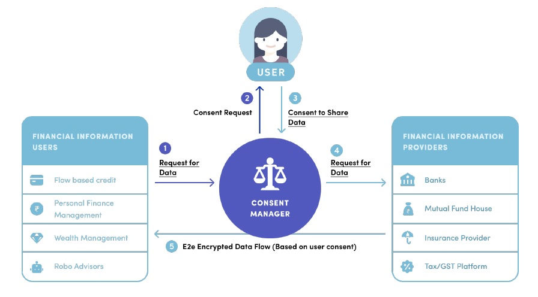

# Data Sharing in DEPA

The Data Empowerment and Protection Architecture (DEPA) is digital public good (DPG) that empowers data principals to share their data residing with one or more _data providers_ with _data consumers_ who wish to use data to provide services. All data sharing in DEPA is mediated by fine-grained and timely consent - data flows to data consumers only after clear and explicit consent has been obtained from the data principal. DEPA introduces an entity called the _Consent Manager_, which helps citizens manage consent requests. DEPA also defines data formats, APIs and protocols to simplify and standardize the process of obtaining credible data for making better decisions e.g., deciding what services to offer. 

While DEPA to a large extent addresses the challenge of obtaining authentic personal data, this data is purpose-limited. Its use is limited to offering a specific service for which consent was obtained. This data cannot be used or shared for other purposes such as analytics or training models. Therefore, organizations that wish to build better models are constrained by the lack of high quality training datasets. This is especially true for smaller organizations that do not have a large user base of their own. For such organizations, creating new datasets is both expensive, laborious, and time-consuming. 

An alternative is to source data from other organizations. For example, advertisers can (and often do) source data from other providers to enrich their own datasets. A fintech that specializes in fraud detection could in theory source transaction data from financial institutions such as banks, credit bureaus, and payment gateways. But such ad-hoc data sharing arrangements often compromise user privacy, lack transparency, and are anti-competitive. It is therefore not surprising that such arrangements are increasingly viewed with a lot of suspicion from law makers, regulators and the public at large. In fact, this has motivated a number of privacy laws such as HIPAA and GDPR which recognize each individual's right to privacy and require that organizations establish a legal basis before using or sharing personal data. 

## Limits of Consent 

In theory, it is possible to obtain separate consent for analytics and training purposes. However, fine-grained consent is not practical for these scenarios for the following reasons.

- Data principals do not directly benefit from analytics and training. These tasks benefit businesses and sometimes the society. Therefore, unless appropriately incentivized, data principals are less likely to consent to the use of their data for these purposes. 
- Analytics and training requires data to be used multiple times over a longer time period. For example, training a flow-based credit model requires a dataset of past borrowers and their profiles. This dataset is useful for training only when it has been labelled with additional information collected over time such as whether the borrower defaulted or not. This label may only be available a long time after the data was collected. Therefore, consent obtained at the time the data was first obtained is less meaningful. 
- Analytics and training often require data from multiple sources to be aggregated and joined. Consent collect at source should not be construed to allow arbitrary aggregation and joining with data from other sources since such operations can significantly compromise privacy.  

## De-identification

For scenarios where consent is not practical, modern privacy laws permit alternative ways for establishing a legal basis for sharing and processing bulk data. It is possible to share and process _de-identified_ data __as long as the risk of re-identification has been minimized__. There are a number of de-identification techniques, e.g., data masking, PII-scrubbing, and k-anonymization. 

Recently, real world studies have shown that user information can often be reverse engineered from de-identified datasets e.g, by correlating attributes in the dataset with additional data. The canonical example is the the Netflix dataset which was released for research purposes. Researchers subsequently showed that it was easy to re-identify Netflix users.  

## Privacy-preserving Data Sharing

The challenges in data sharing have given rise to a number of _privacy preserving technologies_ (PETs), which enable secure and private sharing of datasets. Some of the technologies namely confidential computing, differential privacy, and distributed ledgers have matured over the last decade and are finding applications at scale. The DEPA training framework aims to build on these technologies and enable privacy-by-design data sharing and unlock the true value of data and AI. 
