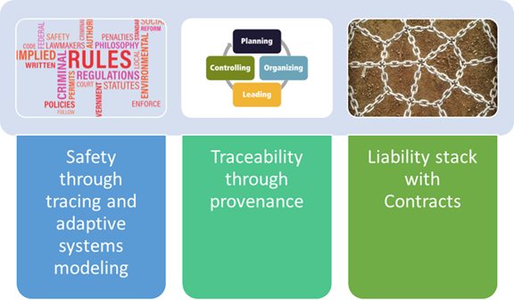

# DEPA Regulatory Framework

The DEPA regulatory framework is designed to support and promote the AI innovation ecosystem. It operates in the background, managing the flow of data, devices, people and services through the system.

It includes elements that observe individual consent, assure purpose limitation for data usage, enhance privacy protection, ensure data provenance, and protect the copyright of data and AI models. These elements enhance its functionality and secure compliance with existing regulations including Digital Data Protection Act, 2024.

DEPA envisages a sector-specific Self Regulatory Organization (SRO), a mutually trusted oversight body that defines and enforces a common set of sector-specific rules. The SRO uses a centralized contract service to ensure that the risk and returns are fairly distributed between participants

## Conceptual Flow

Data principals consent for data to be used for specific purposes, including, data aggregation into privacy-preserved data sets which can be used for model training. This aggregation is done by the Training Data Providers (TDPs) after applying redaction, pseudonymization and anonymization measures, as required. TDPs make their datasets available to Training Data Consumers (TDCs). Discovery Agents may act as middlemen to enable this pairing of data sets (TDPs) to models (TDCs).

The models built by the TDCs may be used for building applications by App builders who develop AI Applications for different users and use cases. The apps are distributed on the App platform and acquired by the users. The data generated by the interaction between the user and the app is acquired by the app creator and may be used internally or provided to a TDP for aggregation into further data sets.

## Concrete Flow

- Every data principal is registered with a unique ID which Mosip or a DID system may provide, as specified by the SRO. The data principal shares the data and consent artefact with the TDP. This interaction is governed by the contract between the data principal and the TDP. The contract may provide for payments or other forms of remuneration, in kind, to the data principal. This allows each element of the dataset to be traced down to the source and data transformation operations to be transparently identified.

- Each data set has its unique ID which is obtained from a global system. Different versions and subsets of data are treated as independent or individual data sets.

- The data sets are anonymized/pseudonymized and contain no private data. The data sets are published by the TDPs with descriptive metadata as well as samples which allow TDCs to determine whether the data sets are useful for building their models. TDPs may provide datasets to the TDCs through discovery agents or directly. In addition, the TDCs can check the provenance and copyright aspects of the data that is being used in their models.

- The TDCs sign [contracts](contracts.md) with TDPs whose data sets they wish to use for training. The contracts are electronic objects created on the electronic contract platforms provided by the SRO or SRO-validated platforms.

- The contracts that govern the model-building training cycles are usually three-party contracts that involve TDPs, TDCs and Confidential Clean Room Providers (CCRP). The CCR platforms guarantee that the model is built in a privacy-preserving/differential privacy constraint honouring strategy using the technology framework deployed by the confidential clean room provider. The privacy budget associated with the data sets is defined by the TDPs who provide the data sets.

- The models are used by the App builders to build user apps. The model safety, accuracy and related aspects are guaranteed by the TDCs who train and test the models. These guarantees are encoded into the contract and their compliance is monitored by the SRO.

- The Apps are distributed to the users via the app platforms. The app platform provides some guarantees to the user regarding the declared functionality of the app, its data safety, privacy guarantees etc.

- The end-user agreement between the user and the application provider can involve consent from the user to allow the application to use the data. The data collected may be used to improve the application characteristics or use the data for creating further data sets. This use of data to create further data sets will also play a strong role in preventing monopolies created by user apps with a large user base.

The implementation of the liability in terms of the contracts requires that all the activity and the data flowing through the system be monitored and managed. The payment terms in the contract may also require the resource usage etc to be measured quantitatively.

This monitoring, measuring and managing the obligations in the contracts require a framework for logging the activities to be in place which uses the unique IDs of the data principals, data sets, data providers, consumers, apps and users to ensure complete traceability. The contracts contain obligations that ensure that all the participants abide by this level of transparency and log sharing that is required both between the participants and the SRO.

## Example: Usage-based Insurance

Let’s consider the example of providing usage-based insurance for passenger vehicles. Increasingly, cars come with homing devices and advanced instrumentation that can detect beyond just the speed of the vehicles and understand complex dangerous driving patterns etc. Combining this data collected with geographical information on where the cars are being driven majorly becomes a rich source of training data. Here, car sellers and manufacturers become TDPs. Potential TDCs could include insurance service providers, who using the data collected, could train their AI model to provide highly personalised usage-based insurance to passenger vehicles. The discovery agent can assist TDCs in finding interested TDPs with relevant datasets.

The contracts that govern the model-building training cycles are usually three-party e-contracts that involve TDPs, TDCs and Confidential Clean Room Providers (CCRP). The CCRP will provide the CCR environment such that TDP will have limited visibility into the technical specifications of the model being trained and the TDC into to datasets used to train AI models.

Once the model is trained, the TDC will only get the trained model and will not be able to access the datasets shared by the TDP for model training. The data protection constraints will be maintained by the TDP.

The SRO will monitor that the TDP and TDC are acting in compliance with the terms and conditions of the e-contracts.
