# Workflows

__Disclaimer: All workflows are representative only and subject to change.__

## Participant registration

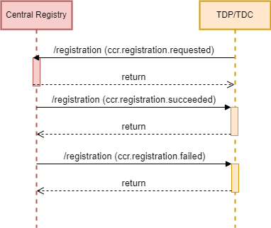

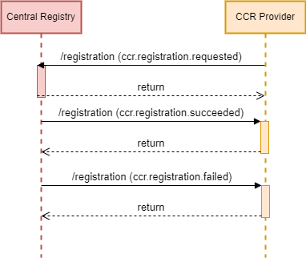

## Dataset registration

## Dataset discovery

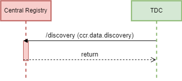

## Contract

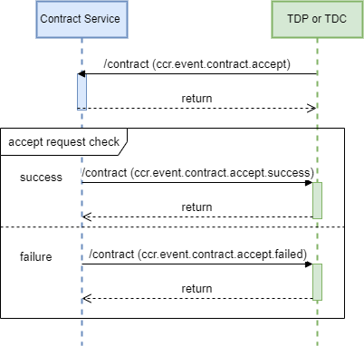

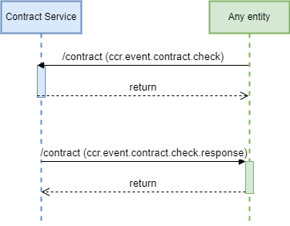

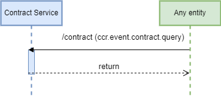

## Authorization

TDCs need to obtain explicit authorization from the authorization server before requesting access to datasets from TDPs.

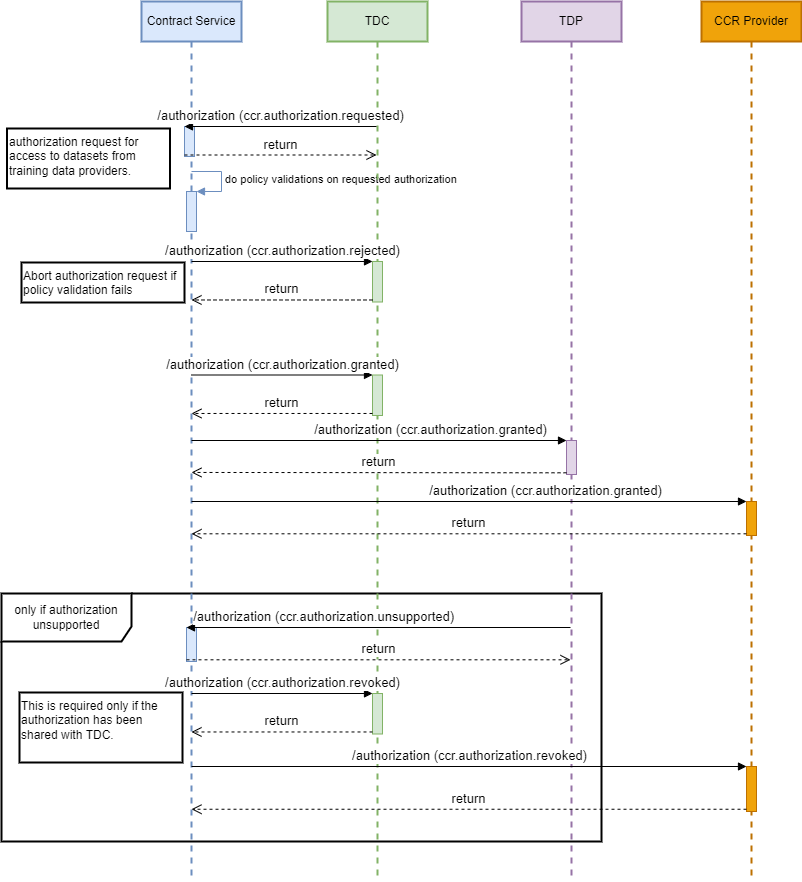

- TDC sends an authorization request to the authorization server. The request includes attributes such as identity of the TDP, identity of the CCR provider, purpose for which the dataset is required, and privacy attributes such as privacy budget. 
- The authorization server checks if the TDC can be granted access to the dataset based on contracts that exist between the TDP and TDC.
- If a valid contract exists, the authorization server grants access by responding with an auth token. 
- The authorization server can deny authorization if a valid contract does not exist, 

## Dataset fetching

## Model fetching

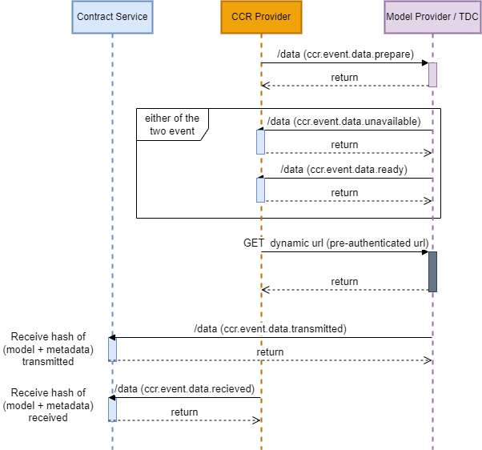

## Provisioning flow

## Attestation Flow

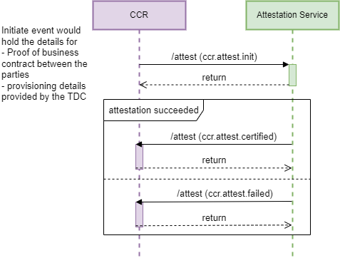

## Key release

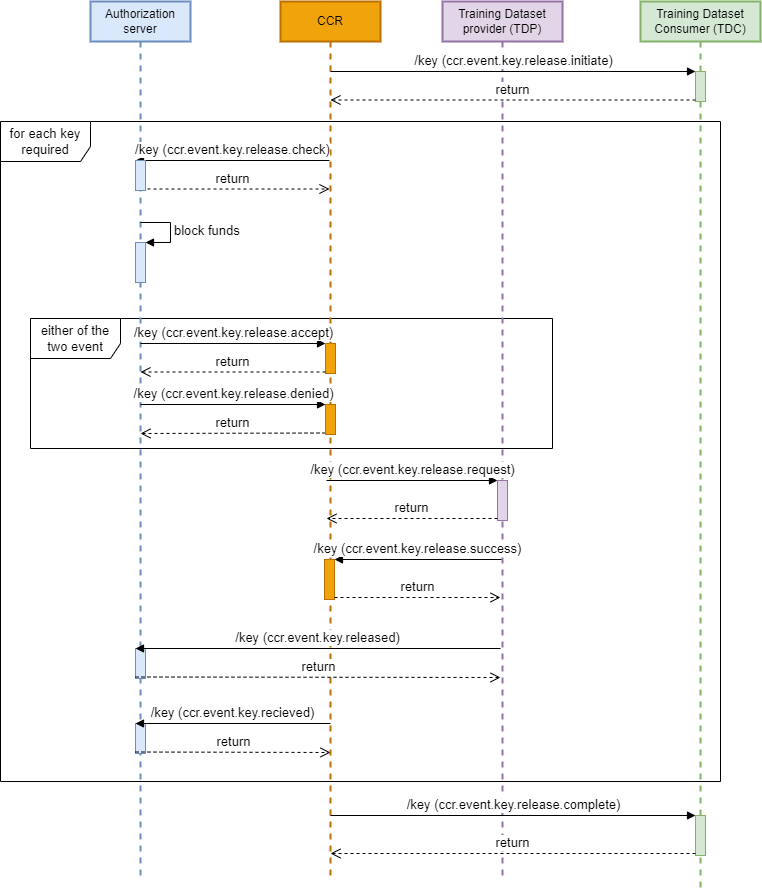

## Logs sharing

## Trained model sharing

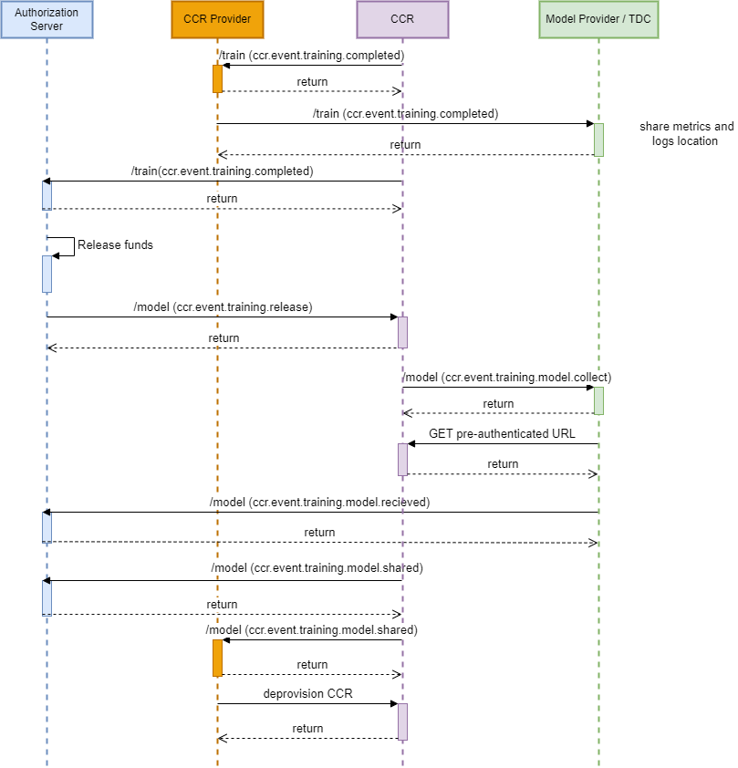
